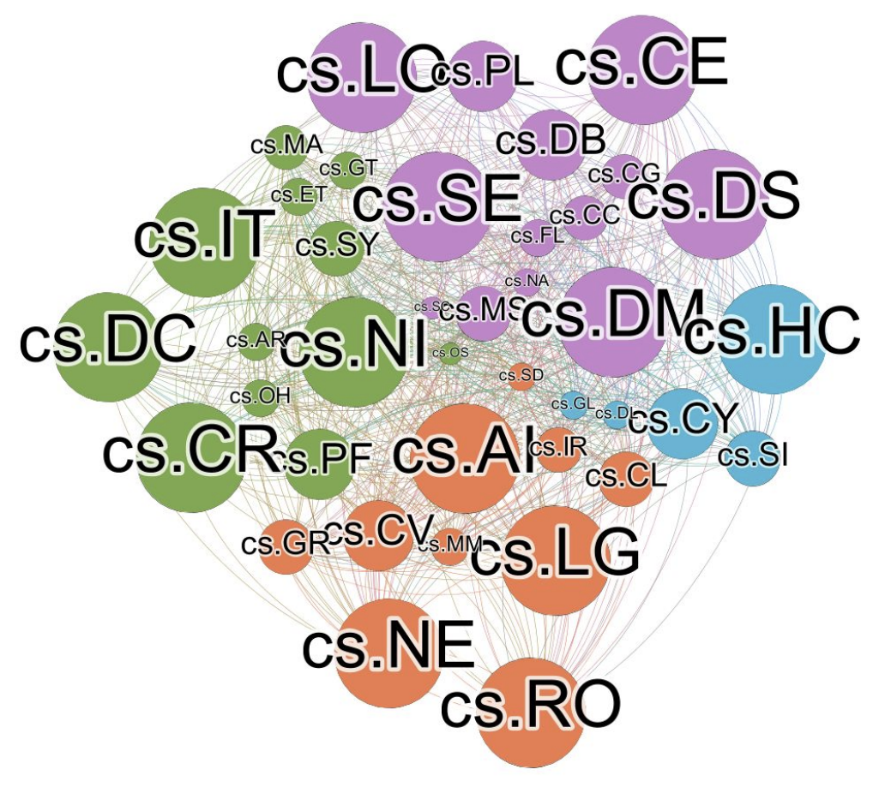

# Data in a Haystack - final project
> Analysis of Arxiv data done as a final project in a University course (topics in data science).

We analyze scientific papers from arxiv, focusing on the computer science field.

We use data analysis and graph mining techniques to find interesting observations.

The data was composed of three components:
- Metadata, including abstract.
- References between papers - only within arxiv.
- Authors.

Due to availability issues, the references and authors data are partial  - up to 3/2019.

The analysis can be run by executing the jupyter notebook analysis.ipynb.
A detailed version of the analysis can be found in analysis.pdf.



## Installation

```sh
pip install -r requirements.txt
```

To get the data, follow [these](https://github.com/mattbierbaum/arxiv-public-datasets) instructions, and download the relevant files from [here](https://github.com/mattbierbaum/arxiv-public-datasets/releases).

Part of the analysis requires R to be installed.

## Collaborators

This project was done by Ella Zeldes, Ory Asida and Meirav Caspi. 
